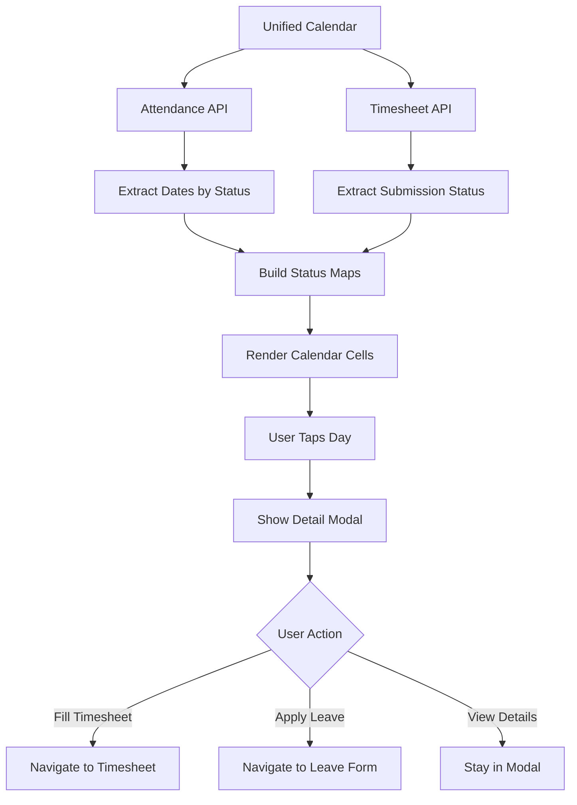

# Unified Calendar - Implementation Walkthrough

## 📋 Overview

Created a **Unified Calendar** screen that combines three critical HR functions into a single, intuitive interface:
- ✅ **Attendance Records** - View attendance status (Present, Leave, Absent, etc.)
- 📝 **Timesheet Status** - Track timesheet submission (Draft, Submitted, Pending)
- 🏖️ **Leave Application** - Quick access to apply for leave

## 🎯 Key Features

### 1. **Multi-Layer Calendar Visualization**

The calendar displays multiple data types simultaneously:

- **Color-coded cells** show primary status based on active filter
- **Dual indicators** in "All" view show both attendance and timesheet status
- **Status dots** provide quick visual feedback
- **Border highlighting** emphasizes important statuses

### 2. **Smart Filtering System**

Four view modes to focus on specific data:

| Filter | Description |
|--------|-------------|
| **All** | Shows both attendance and timesheet indicators |
| **Attendance** | Highlights attendance status only |
| **Timesheet** | Displays timesheet completion status |
| **Leave** | Filters to show only leave days |

### 3. **Interactive Day Details**

Tapping any calendar day opens a comprehensive modal showing:

**Attendance Section:**
- Status badge with color-coded indicator
- Status label (Present, Leave, Week Off, etc.)

**Timesheet Section:**
- Submission status (Draft/Submitted)
- "View Timesheet" button if filled
- "Fill Timesheet" button if pending
- Disabled for future dates

**Leave Application:**
- Quick "Apply for Leave" button
- Pre-fills the selected date

### 4. **Color Coding System**

#### Attendance Colors
- 🟢 **Green (#10B981)**: Present
- 🟣 **Purple (#8B5CF6)**: On Leave  
- 🔵 **Gray (#6B7280)**: Week Off
- 🟡 **Orange (#F59E0B)**: Comp Off
- 🔴 **Red (#EF4444)**: Missed Punch
- 🟠 **Orange (#F97316)**: Absent
- 💗 **Pink (#EC4899)**: Holiday

#### Timesheet Colors
- 🟢 **Green (#10B981)**: Submitted
- 🟡 **Amber (#F59E0B)**: Draft

## 📁 File Structure

### New File Created
- [unified-calendar.tsx](file:///c:/Users/admin/Music/newpg/ModernIHRMS/app/(tabs)/unified-calendar.tsx) - Main unified calendar screen

### Modified Files
- [_layout.tsx](file:///c:/Users/admin/Music/newpg/ModernIHRMS/app/(tabs)/_layout.tsx) - Added new tab for unified calendar

## 🔧 Technical Implementation

### Data Integration

The screen fetches data from two primary sources:

```typescript
// Attendance API
const { data: attendanceResponse } = useAttendanceRecords(getMonthStartEnd(currentMonth));

// Timesheet API  
const { data: timesheetStatus } = useTimesheetCalendar(monthName, yearStr);
```

### Multi-Status Rendering Logic

```typescript
// For "All" view - shows both indicators
{viewFilter === 'all' && (
    <View style={styles.dotsContainer}>
        {showAttendanceDot && (
            <View style={[styles.miniDot, { backgroundColor: attendanceColor }]} />
        )}
        {showTimesheetDot && (
            <View style={[styles.miniDot, { backgroundColor: timesheetColor }]} />
        )}
    </View>
)}
```

### Date Extraction Utilities

Robust date parsing handles multiple formats:
- `YYYY-MM-DD` (ISO format)
- `DD-MM-YYYY` (Common API format)
- Object with date fields (`attend_date`, `date`, etc.)
- Date ranges (`from_date`, `to_date`)

## 🎨 UI/UX Design Decisions

### 1. **Visual Hierarchy**
- Primary status shown via cell background and border
- Secondary indicators via small dots at bottom
- Today's date highlighted with primary color

### 2. **Responsive Design**
- Grid layout adapts to screen width (14.28% per day)
- Consistent spacing across all devices
- Touch-friendly 36x36px cells

### 3. **Modal Bottom Sheet**
- Slides up from bottom for natural mobile interaction
- Scrollable content for longer details
- Clear section separation with icons

### 4. **Smart Navigation**
- Prevents future month access
- Disables future date interactions
- Auto-navigates to relevant screens with pre-filled data

## 🚀 Usage Guide

### Accessing the Unified Calendar

1. Navigate to the **"Unified"** tab in the bottom navigation
2. Select a filter view (All/Attendance/Timesheet/Leave)
3. Navigate between months using arrow buttons

### Interacting with Days

1. **Tap any day** to see detailed information
2. From the modal, you can:
   - View attendance status
   - Fill or view timesheet
   - Apply for leave from that date

### Quick Actions

| Action | Navigation |
|--------|------------|
| Fill Timesheet | Opens timesheet screen with selected date |
| View Timesheet | Opens existing timesheet for viewing/editing |
| Apply Leave | Opens leave application with from_date pre-filled |

## 🔄 Data Flow



## 💡 Benefits Over Individual Screens

### Before (Separate Screens)
- ❌ Need to switch between 3 different screens
- ❌ No unified view of employee activities
- ❌ Hard to correlate timesheet with attendance
- ❌ Multiple taps to access related functions

### After (Unified Calendar)
- ✅ **Single source of truth** for all calendar data
- ✅ **Contextual actions** based on day status
- ✅ **Quick filtering** to focus on specific data
- ✅ **One-tap access** to fill timesheet or apply leave
- ✅ **Better UX** with comprehensive day view

## 🎯 Future Enhancement Ideas

### Potential Improvements
1. **Offline Support**: Cache calendar data for offline viewing
2. **Notifications**: Show pending timesheet indicators
3. **Bulk Actions**: Select multiple days for bulk leave application
4. **Custom Legends**: User-configurable color schemes
5. **Download Reports**: Export monthly attendance/timesheet PDFs
6. **Team View**: Managers could see team member calendars
7. **Holiday Integration**: Highlight company holidays
8. **Performance Metrics**: Show monthly productivity stats

### Advanced Features
- **Calendar Sync**: Export to Google Calendar/Outlook
- **Recurring Patterns**: Identify attendance patterns
- **Predictive Alerts**: Warn about incomplete timesheets
- **Cross-Month Views**: See quarterly or annual summaries

## 📱 Tab Navigation

The unified calendar is accessible via the new **"Unified"** tab with a **Layers icon** (📊), positioned between Attendance and Timesheet tabs for logical flow:

1. Dashboard 🏠
2. Attendance 📅
3. **Unified** 📊 ← NEW
4. Timesheet 📝
5. Profile 👤

## ✅ Testing Checklist

- [ ] Calendar renders correctly for current month
- [ ] Month navigation works (previous/next)
- [ ] Cannot navigate to future months
- [ ] Filter tabs switch views correctly
- [ ] Day cells show correct status colors
- [ ] Tapping a day opens detail modal
- [ ] Modal shows accurate attendance data
- [ ] Modal shows accurate timesheet data
- [ ] "Fill Timesheet" button navigates correctly
- [ ] "Apply Leave" button navigates correctly
- [ ] Legend matches displayed statuses
- [ ] Works in both light and dark theme
- [ ] Data refetches when returning to screen
- [ ] Loading states display properly

## 🎉 Summary

The Unified Calendar successfully consolidates three separate workflows into a single, elegant interface. It provides:

- **Enhanced Visibility**: See all your work-related calendar data at a glance
- **Improved Efficiency**: Quick access to all related actions from one screen
- **Better UX**: Contextual navigation and smart filtering
- **Modern Design**: Premium aesthetics with smooth interactions

This implementation demonstrates best practices in React Native development with proper state management, API integration, and user-centric design.
